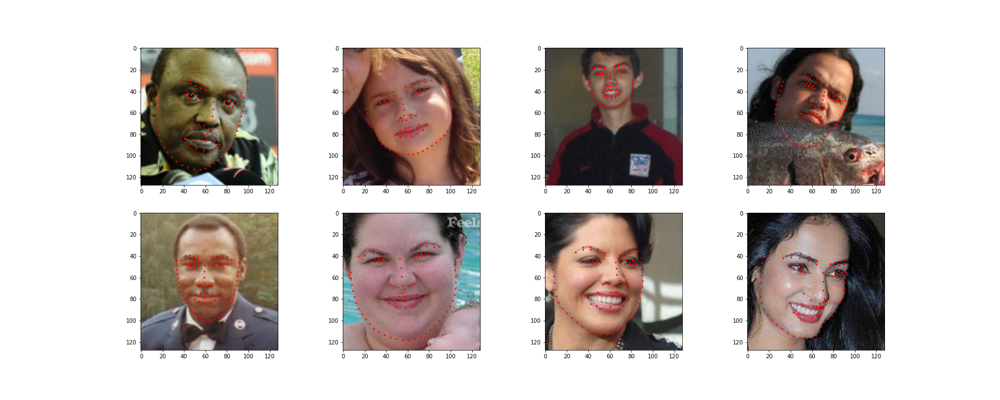
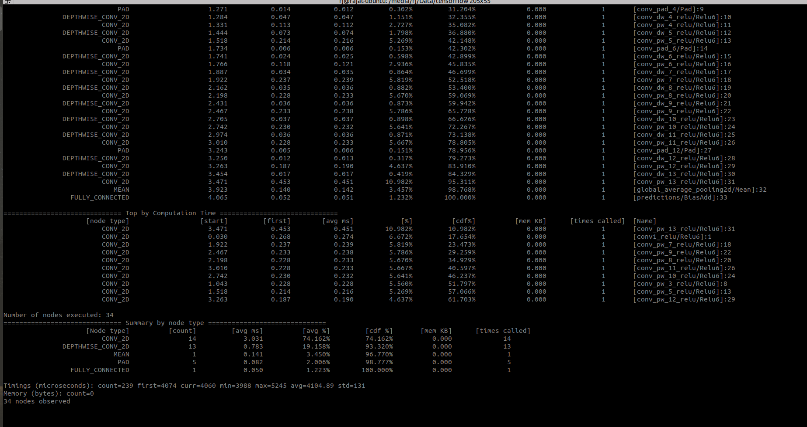

# face-keypoints-detection

## Introduction

1. python3 -m venv env
2. pip install -r requirements.txt

Real time face keypoints detection for mobile devices using tflite on mobile gpus. Face keypoints detection is used in many applications like applying makeup,
instagram filters etc.Generally face keypoint or body keypoint detection are solved using hourglass or
encoder-decoder CNN architectures, but those architectures large and slow for edge use cases.
So I am trying to solve this problem by treating it as a regression problem on an open source dataset
i.e. directing predicting x and y coordinates of the keypoint by using MobilenetV1 (pretrained on ImageNet).

When building deep learning models for mobile device especially for real-time use cases ( fps >= 30 ), inference and
model size are the most important things to keep in mind.

There are a few ways to increase inference time:
   * Decrease input image size.
   * Use smaller networks like MobileNets.
   * If making custom models try to use as less layers as possible.
      Decreasing depth of the model decreases the inference time more than decreasing the width of the model.

## Quick Start
  1. Download the dataset from [here](https://wywu.github.io/projects/LAB/LAB.html) and extract in `data` folder.
  2. Run `convert_data.py` to process the data.
      It processes the given label formet and extract faces from data images and
      saves into `train_images`  and `test_images` inside `data` folder.
      ```
      python convert_data.py
      ```
  3. Run `train.py` to train model and save weights in `weights`.
      ```
      python train.py
      ```
  4. Run 'convert_model.py' to convert saved h5 model to tflite.
      ```
      python convert_model.py --model_filename face_keypoint_mobile.h5 --tflite_filename face_keypoint_mobile.tflite
      ```

## Results

<p align="center">
  
</p>

<p align="center">
  <em>Prediction examples</em>
</p>

<p align="center">
  
</p>

<p align="center">
  <em>Groud truth examples</em>
</p>

## Speed Profiling

I have done speed profiling of this model on **Oneplus 7** using [tensorflow benchmark tool](https://github.com/tensorflow/tensorflow/tree/master/tensorflow/lite/tools/benchmark). You can see this model takes average of **4.1 ms** i.e it runs at **243 fps**.

<p align="center">
  
</p>

## Reference

* [Real-time Facial Surface Geometry from Monocular Video on Mobile GPUs](https://sites.google.com/view/perception-cv4arvr/facemesh)

* [Look at Boundary: A Boundary-Aware Face Alignment Algorithm](https://wywu.github.io/projects/LAB/LAB.html)
